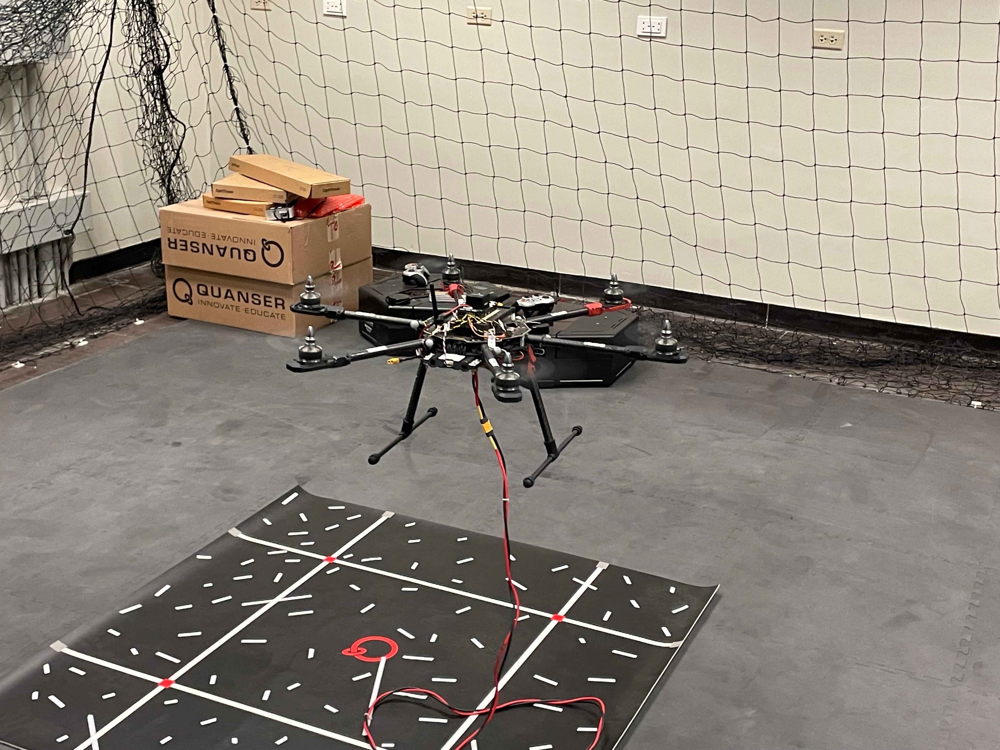
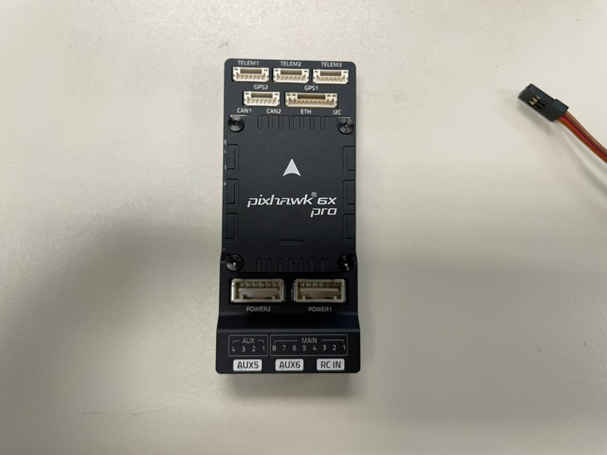
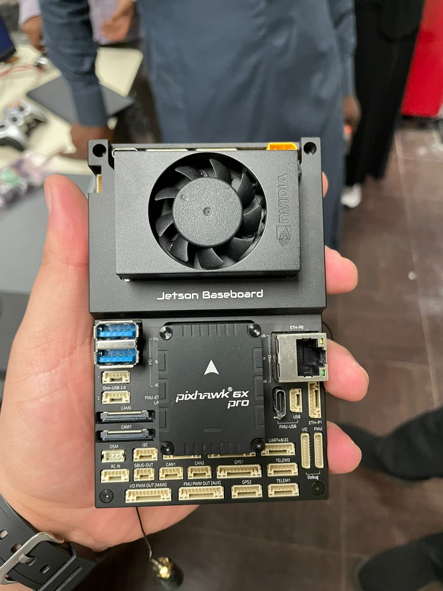
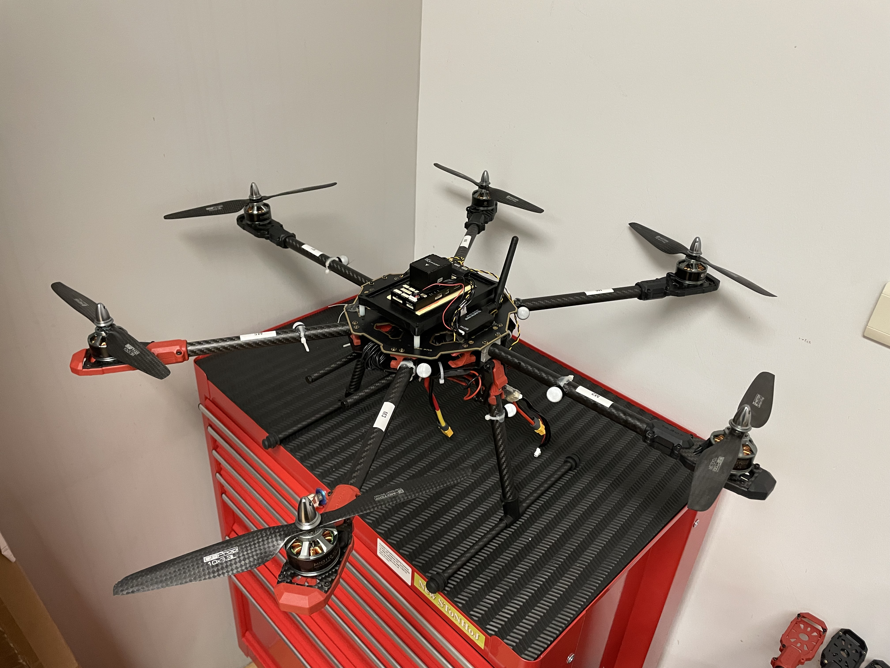

# UAV Systems Integration with PX4 and ROS 2

This repository summarizes my hands-on work with UAV hardware, onboard computing, PX4, and ROS 2 at the ARM4L Lab in IRC-SML at KFUPM. My work focused on assembling and configuring a hexacopter autonomy platform built around a Pixhawk/PX4 flight controller and NVIDIA Jetson companion computer, integrating communication and sensing hardware, and establishing the software infrastructure for autonomous flight experiments. I also worked with SITL/HIL simulation, flight testing, calibration, and system-level debugging.

---

## UAV Platform & Hardware Integration

- Assembled and configured a research hexacopter platform.
- Worked with a Pixhawk/PX4 flight controller and NVIDIA Jetson companion computer.
- Configured telemetry and manual RC control for flight testing and failsafe operation.
- Integrated optical-flow, RGB, and FPV sensing hardware.
- Performed flight-controller configuration, calibration, flight testing, and hardware troubleshooting.
- Prepared documentation for each of the steps for reproducibility.

---

## PX4, ROS 2 & Onboard Autonomy

- Configured PX4 ↔ Jetson communication using MAVLink over Ethernet and serial.
- Set up XRCE-DDS communication between PX4 and ROS 2.
- Used ROS 2 Humble with Gazebo Ignition for SITL/HIL testing.
- Worked with QGroundControl for vehicle configuration and telemetry.
- Debugged networking, telemetry, and companion-computer synchronization issues.

---

## Sensors & Peripherals

The platform included several communication and sensing components that I configured and tested:

- Holybro SiK telemetry radio
- RadioMaster TX16S transmitter/receiver
- Optical-flow sensor
- RGB camera
- FPV camera and air unit

---

## Mounting Hardware Design and Flight Testing
- Designed and adapted mounting hardware for the onboard electronics and was responsible for the fabrication process.
- The designs included:
  - Pixhawk 6X pro mounting plate
  - Jetson-Pixhawk mounting plate
  - ARC Flow MR mounting plate

- Flight Testing included:
  - Progressed the UAV platform from bench integration to flight testing.
  - Performed vehicle configuration and calibration.
  - Verified communication links and system connectivity.
  - Conducted flight tests and evaluated system behavior.
  - Troubleshot issues encountered during unsuccessful tests.
  - Repaired or replaced damaged components when required.   

---

### FPV Drone Racing

Separately, I designed and assembled a custom FPV quadcopter from the frame and individual components and competed using Betaflight. I placed 2nd in the 8th International FPV Drone Racing Competition at the Military Technical College, Egypt, in August 2024.
